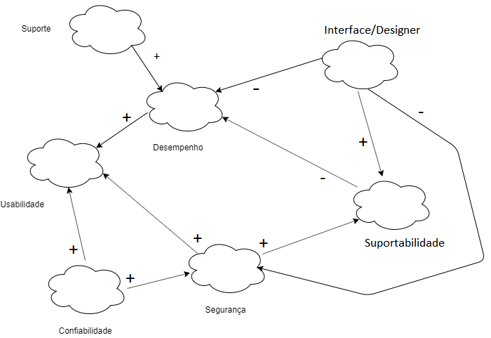

## Introdução

Trata-se de um framework conceitual para condução da Engenharia de Requisitos orientada aos requisitos não funcionais, ele decompõe os requisitos facilitando assim a compreensão e a priorização.

## NFR00 - Geral

| **NFR00**           | **Atores**                                    |
| ------------------- | --------------------------------------------- |
| **Versão**          | Atual: 1.0                                    |
| **Rastreabilidade** | [Especificação Suplementar](../especificacao) |
