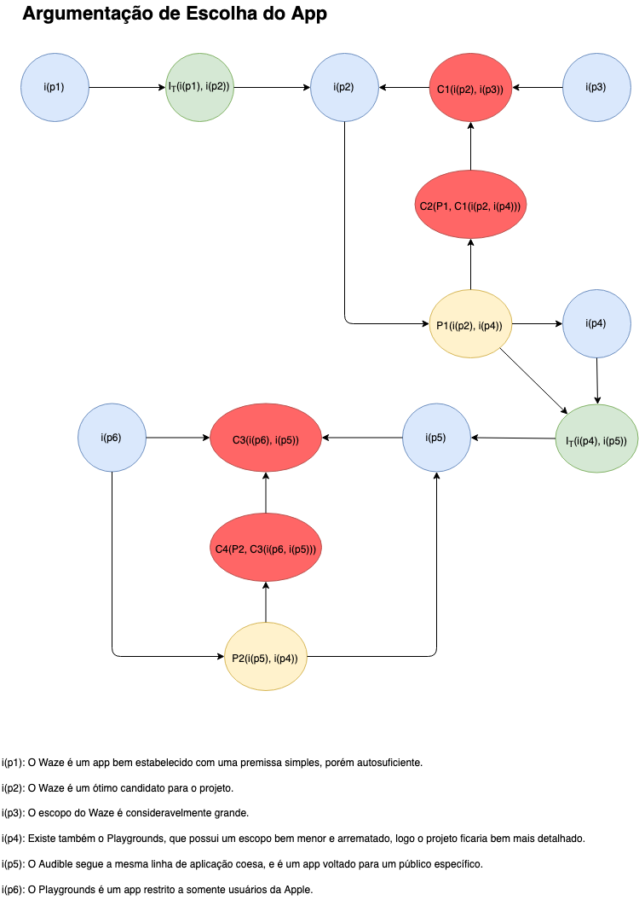
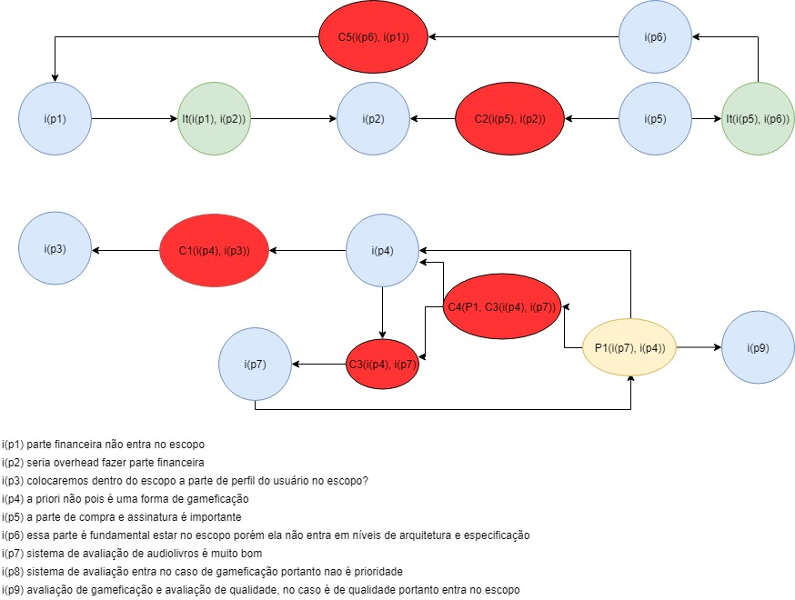

# Argumentação
## Versionamento
| Versão | Data | Modificação | Autor |
| :---: | :---: | :---: | :---: |
| 1.0 | 27/08/2019 | Adição da [AR1](#ar1-escolhadoapp) | [João Gabriel](https://github.com/flyerjohn) |
| 1.1 | 27/08/2019 | Adição da [AR2](#ar2-escopodoapp) | [Marco Antônio](https://github.com/markinlimac) |

## Introdução

&emsp;&emsp;A argumentação também é uma técnica usada na pré rastreabilidade, mas ao contrário do rich picture é um artefato formal. Seu principal objetivo é ajudar na resolução de conflitos entre vários argumentos usando uma visão mais técnica, a fim de buscar uma conclusão plausível para pontos de vista diferentes.

## AR1 - Escolha do App

## AR2 - Escopo do App

