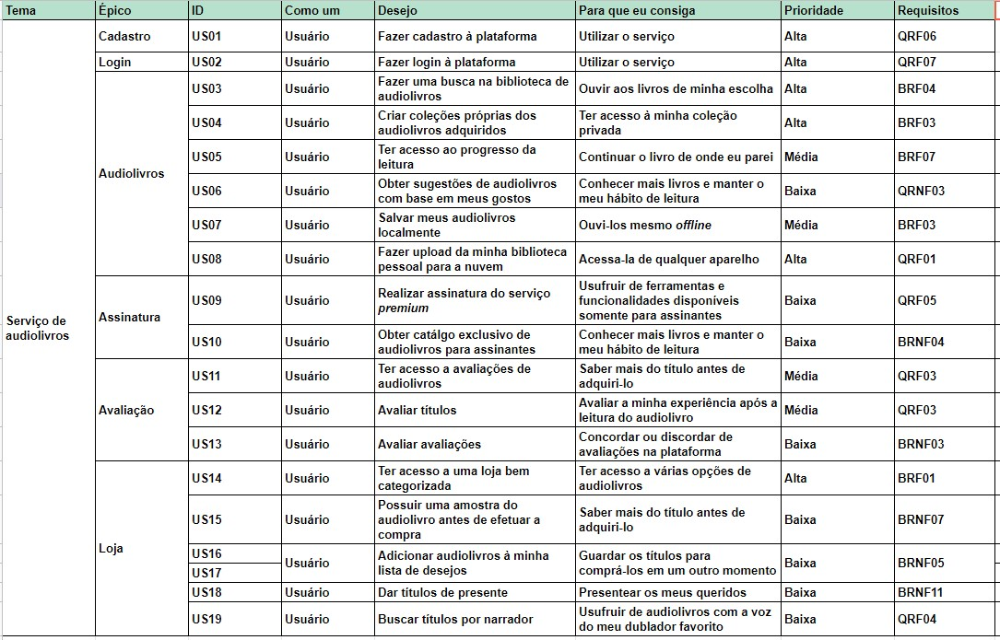

# Backlog do Produto
## Versionamento
| Versão | Data | Modificação | Autor |
| :---: | :---: | :---: | :---: |
| 1.0 | 21/10/2019 | Adição do Backlog | [André Goretti](https://github.com/Agoretti), [Marco Antonio](https://github.com/markinlimac) e [João Gabriel](https://github.com/flyerjohn) |

## Introdução
Em termos gerais, o Product BackLog é uma listagem de todos os afazeres pendentes no projeto. Ele substitui o modelo tradicional de especificação de artefatos. Cada elemento da listagem é elicitado por meio de interação da equipe de desenvolvimento com o Cliente - podendo ser apenas um representante, o que torna os elementos levantados muito arbitrários; ou podendo ser uma equipe representante do Cliente, representando as diversas áreas que utilizarão o produto.

## Backlog

### EP01: Cadastro
#### US01: Fazer cadastro à plataforma
Eu, como um usuário, desejo fazer cadastro à plataforma para que eu consiga utilizar o serviço.
##### Critérios de aceitação
<ul>
  <li></li>
  <li></li>
</ul>

### EP02: Login
#### US02: Fazer login à plataforma
Eu, como um usuário, desejo fazer login à plataforma para que eu consiga utilizar o serviço.
##### Critérios de aceitação
<ul>
  <li></li>
  <li></li>
</ul>

### EP03: Audiolivros
#### US03: Fazer uma busca na biblioteca de audiolivros
Eu, como um usuário, desejo fazer uma busca na biblioteca de audiolivros para que eu consiga ouvir aos livros de minha escolha.
##### Critérios de aceitação
<ul>
  <li></li>
  <li></li>
</ul>

#### US04: Criar coleções próprias dos audiolivros adquiridos
Eu, como um usuário, desejo criar coleções próprias dos audiolivros adquiridos para que eu consiga ter acesso à minha coleção privada.
##### Critérios de aceitação
<ul>
  <li></li>
  <li></li>
</ul>

#### US05: Ter acesso ao progresso da leitura
Eu, como um usuário, desejo ter acesso ao progresso da leitura para que eu consiga continuar o livro de onde eu parei.
##### Critérios de aceitação
<ul>
  <li></li>
  <li></li>
</ul>

#### US06: Obter sugestões de audiolivros com base em meus gostos
Eu, como um usuário, desejo obter sugestões de audiolivros com base em meus gostos para que eu consiga conhecer mais livros e manter o meu hábito de leitura.
##### Critérios de aceitação
<ul>
  <li></li>
  <li></li>
</ul>

#### US07: Salvar meus audiolivros localmente
Eu, como um usuário, desejo salvar meus audiolivros localmente para que eu consiga ouvi-los mesmo offline.
##### Critérios de aceitação
<ul>
  <li></li>
  <li></li>
</ul>

#### US08: Fazer upload da minha biblioteca pessoal para a nuvem
Eu, como um usuário, desejo fazer upload da minha biblioteca pessoal para a nuvem para que eu consiga acessa-la de qualquer aparelho.
##### Critérios de aceitação
<ul>
  <li></li>
  <li></li>
</ul>

### EP04: Assinatura
#### US09: Realizar assinatura do serviço premium
Eu, como um usuário, desejo realizar assinatura do serviço premium para que eu consiga usufruir de ferramentas e funcionalidades disponíveis somente para assinantes.
##### Critérios de aceitação
<ul>
  <li></li>
  <li></li>
</ul>

#### US10: Obter catálogo exclusivo de audiolivros para assinantes
Eu, como um usuário, desejo obter catálogo exclusivo de audiolivros para assinantes para que eu consiga conhecer mais livros e manter o meu hábito de leitura.
##### Critérios de aceitação
<ul>
  <li></li>
  <li></li>
</ul>

### EP05: Avaliação
#### US011: Ter acesso a avaliações de audiolivros
Eu, como um usuário, desejo ter acesso a avaliações de audiolivros para que eu consiga saber mais do título antes de adquiri-lo.
##### Critérios de aceitação
<ul>
  <li></li>
  <li></li>
</ul>

#### US012: Avaliar títulos
Eu, como um usuário, desejo avaliar títulos para que eu consiga avaliar a minha experiência após a leitura do audiolivro.
##### Critérios de aceitação
<ul>
  <li></li>
  <li></li>
</ul>

#### US013: Avaliar avaliações
Eu, como um usuário, desejo avaliar avaliações para que eu consiga concordar ou discordar de avaliações na plataforma.
##### Critérios de aceitação
<ul>
  <li></li>
  <li></li>
</ul>

### EP06: Loja
#### US014: Ter acesso a uma loja bem categorizada
Eu, como um usuário, desejo ter acesso a uma loja bem categorizada para que eu consiga ter acesso a várias opções de audiolivros.
##### Critérios de aceitação
<ul>
  <li></li>
  <li></li>
</ul>

#### US015: Possuir uma amostra do audiolivro antes de efetuar a compra
Eu, como um usuário, desejo possuir uma amostra do audiolivro antes de efetuar a compra para que eu consiga saber mais do título antes de adquiri-lo.
##### Critérios de aceitação
<ul>
  <li></li>
  <li></li>
</ul>

#### US016: Adicionar audiolivros à minha lista de desejos
Eu, como um usuário, desejo adicionar audiolivros à minha lista de desejos para que eu consiga guardar os títulos para comprá-los em um outro momento.
##### Critérios de aceitação
<ul>
  <li></li>
  <li></li>
</ul>

#### US017: Adicionar audiolivros à minha lista de desejos
Eu, como um usuário, desejo adicionar audiolivros à minha lista de desejos para que eu consiga guardar os títulos para comprá-los em um outro momento.
##### Critérios de aceitação
<ul>
  <li></li>
  <li></li>
</ul>

#### US018: Dar títulos de presente
Eu, como um usuário, desejo dar títulos de presente para que eu consiga presentear os meus queridos.
##### Critérios de aceitação
<ul>
  <li></li>
  <li></li>
</ul>

#### US019: Buscar títulos por narrador
Eu, como um usuário, desejo buscar títulos por narrador para que eu consiga usufruir de audiolivros com a voz do meu dublador favorito.
##### Critérios de aceitação
<ul>
  <li></li>
  <li></li>
</ul>
