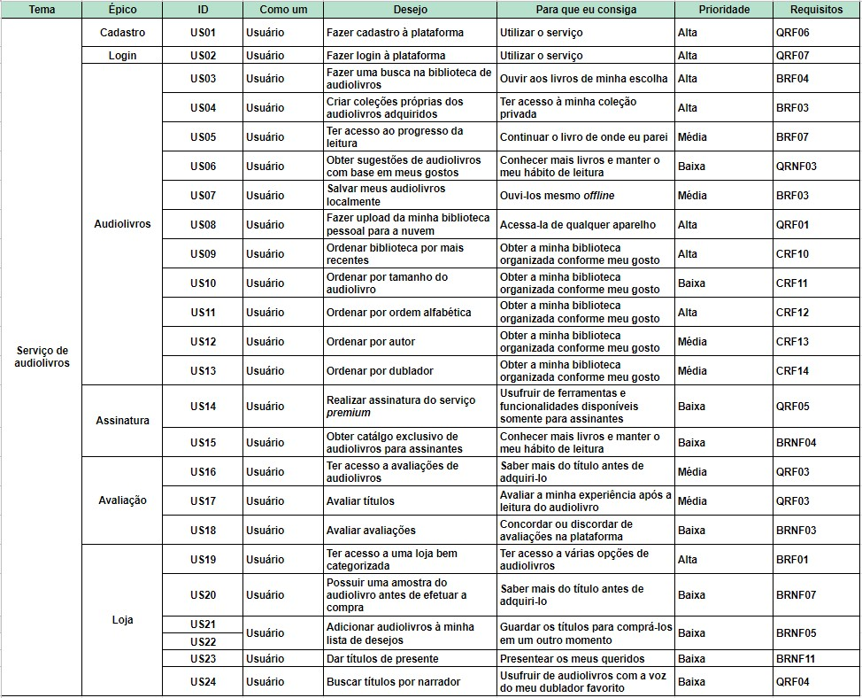

# Backlog do Produto
## Versionamento
| Versão | Data | Modificação | Autor |
| :---: | :---: | :---: | :---: |
| 1.0 | 21/10/2019 | Adição do Backlog | [André Goretti](https://github.com/Agoretti), [Marco Antonio](https://github.com/markinlimac) e [João Gabriel](https://github.com/flyerjohn) |

## Introdução

&emsp;&emsp;Em termos gerais, o Product BackLog é uma listagem de todos os afazeres pendentes no projeto. Ele substitui o modelo tradicional de especificação de artefatos. Cada elemento da listagem é elicitado por meio de interação da equipe de desenvolvimento com o Cliente - podendo ser apenas um representante, o que torna os elementos levantados muito arbitrários; ou podendo ser uma equipe representante do Cliente, representando as diversas áreas que utilizarão o produto.

## Backlog

### EP01: Cadastro
#### US01: Fazer cadastro à plataforma
Eu, como um usuário, desejo fazer cadastro à plataforma para que eu consiga utilizar o serviço.
##### Critérios de aceitação

* Deve conter o botão de criar conta amazon para entrar na pagina
* Deve apresentar áreas para preenchimentos dos dados do novo usuário
* Deve realizar conexão com a amazon
* Deve concluir o cadastro salvando os dados do usuário

### EP02: Login
#### US02: Fazer login à plataforma
Eu, como um usuário, desejo fazer login à plataforma para que eu consiga utilizar o serviço.
##### Critérios de aceitação

* Deve conter o botão de "sing in" para entrar na pagina
* Deve apresentar áreas para preenchimentos dos dados do usuário
* Deve realizar conexão com a amazon
* Deve efetuar o login

### EP03: Audiolivros
#### US03: Fazer uma busca na biblioteca de audiolivros
Eu, como um usuário, desejo fazer uma busca na biblioteca de audiolivros para que eu consiga ouvir aos livros de minha escolha.
##### Critérios de aceitação

* Deve possuir uma aba de pesquisa
* Deve se mostrar resultados próximos
* Deve ter uma pagina de pesquisa avançada com maiores detalhes de livros
* Deve direcionar para a pagina do livro escolhido

#### US04: Criar coleções próprias dos audiolivros adquiridos
Eu, como um usuário, desejo criar coleções próprias dos audiolivros adquiridos para que eu consiga ter acesso à minha coleção privada.
##### Critérios de aceitação

* Deve ter uma área exclusiva de livros salvos
* Deve ter um botão de salvar a biblioteca escolhida
* Deve se apresentar os livros salvos quando disponível
* Deve salvar a lista de livros

#### US05: Ter acesso ao progresso da leitura
Eu, como um usuário, desejo ter acesso ao progresso da leitura para que eu consiga continuar o livro de onde eu parei.
##### Critérios de aceitação

* Deve poder acessar o livro
* Deve salvar no ponto onde o leitor parou
* Deve retornar no mesmo ponto onde o leitor parou
* Deve salvar no inicio quando acabar o livro

#### US06: Obter sugestões de audiolivros com base em meus gostos
Eu, como um usuário, desejo obter sugestões de audiolivros com base em meus gostos para que eu consiga conhecer mais livros e manter o meu hábito de leitura.
##### Critérios de aceitação

* Deve existir uma página de recomendações
* Deve ter salvo os livros lidos por aquele usuário
* Deve ter uma categorização de livros
* Deve mostrar livros associados com os já lidos

#### US07: Salvar meus audiolivros localmente
Eu, como um usuário, desejo salvar meus audiolivros localmente para que eu consiga ouvi-los mesmo offline.
##### Critérios de aceitação

* Deve poder salvar arquivos no sistema
* Deve ter um botão com a opção de salvar
* Deve conseguir baixar o livro por completo
* Deve ter permissão para o livro baixado

#### US08: Fazer upload da minha biblioteca pessoal para a nuvem
Eu, como um usuário, desejo fazer upload da minha biblioteca pessoal para a nuvem para que eu consiga acessa-la de qualquer aparelho.
##### Critérios de aceitação

* Deve ter a opção de salvar livro na sua biblioteca
* Deve ter acesso do aplicativo com a internet
* Deve salvar a biblioteca na nuvem
* Deve ter pagina de livros salvos para a nuvem

### EP04: Assinatura
#### US09: Realizar assinatura do serviço premium
Eu, como um usuário, desejo realizar assinatura do serviço premium para que eu consiga usufruir de ferramentas e funcionalidades disponíveis somente para assinantes.
##### Critérios de aceitação

* Deve ter acesso ao serviço da amazon de login
* Deve conter um serviço de pagamento seguro
* Deve diferenciar tipos de usuarios

#### US10: Obter catálogo exclusivo de audiolivros para assinantes
Eu, como um usuário, desejo obter catálogo exclusivo de audiolivros para assinantes para que eu consiga conhecer mais livros e manter o meu hábito de leitura.
##### Critérios de aceitação

* Deve ter quais livros lindo pelo usuários
* Deve ter categorização de livros
* Deve ter serviços separados de premium e free
* Deve ter uma página de livros recomendados com sugestões
* Deve existir uma pagina de catálogo

### EP05: Avaliação
#### US011: Ter acesso a avaliações de audiolivros
Eu, como um usuário, desejo ter acesso a avaliações de audiolivros para que eu consiga saber mais do título antes de adquiri-lo.
##### Critérios de aceitação

* Deve existir avaliação individual de cada livro
* Deve permitir que o usuário avalie livros
* Deve salvar e gerar media de avaliações
* Deve mostrar a avaliação nas informações do livro

#### US012: Avaliar títulos
Eu, como um usuário, desejo avaliar títulos para que eu consiga avaliar a minha experiência após a leitura do audiolivro.
##### Critérios de aceitação

* Deve existir avaliação individual de cada livro
* Deve permitir que o usuário avalie livros após leitura
* Deve salvar todas as avaliações
* Deve saber se o usuario leu o livro

#### US013: Avaliar avaliações
Eu, como um usuário, desejo avaliar avaliações para que eu consiga concordar ou discordar de avaliações na plataforma.
##### Critérios de aceitação

* Deve conter avaliações de uma avaliação como caracteristica
* Deve avaliar se a avaliação é coerente com o livro
* Deve existir uma pagina sobre a avaliação da avaliação do livro

### EP06: Loja
#### US014: Ter acesso a uma loja bem categorizada
Eu, como um usuário, desejo ter acesso a uma loja bem categorizada para que eu consiga ter acesso a várias opções de audiolivros.
##### Critérios de aceitação

* Deve ter uma categorização bem definida de livros
* Deve existir uma página pratica com todos os livros
* Deve se permitir buscas de livros

#### US015: Possuir uma amostra do audiolivro antes de efetuar a compra
Eu, como um usuário, desejo possuir uma amostra do audiolivro antes de efetuar a compra para que eu consiga saber mais do título antes de adquiri-lo.
##### Critérios de aceitação

* Deve existir um trecho separado do livro como amostra
* Deve permitir para todos tipos de usuários
* Deve existir um botão para ouvir o exemplar

#### US016: Adicionar audiolivros à minha lista de desejos
Eu, como um usuário, desejo adicionar audiolivros à minha lista de desejos para que eu consiga guardar os títulos para comprá-los em um outro momento.
##### Critérios de aceitação

* Deve existir um botão de adicionar a lista
* Deve existir uma lista de desejo para cada usuário
* Deve conter uma aba com sua lista de desejos
* Deve conseguir remover itens dessa lista

#### US018: Dar títulos de presente
Eu, como um usuário, desejo dar títulos de presente para que eu consiga presentear os meus queridos.
##### Critérios de aceitação

* Deve existir um botao com enviar como presente
* Deve ser possivel pesquisar por nome de usuários para mandar o presente
* Deve ter como resgatar o presente
* Deve ter como enviar uma mensagem junto ao presente
* Deve ter como recusar o presente e mandar de volta para o dono

#### US019: Buscar títulos por narrador
Eu, como um usuário, desejo buscar títulos por narrador para que eu consiga usufruir de audiolivros com a voz do meu dublador favorito.
##### Critérios de aceitação

* Deve existir uma aba de pesquisa para narrador
* Deve conter em cada livro o narrador do mesmo
* Deve se possivel ver o narrador de cada livro.
