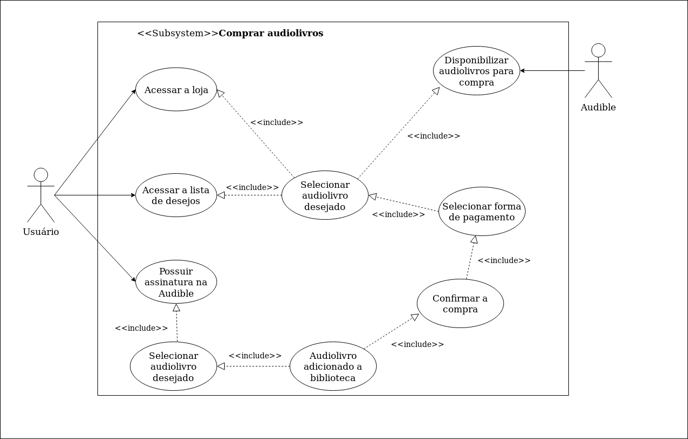
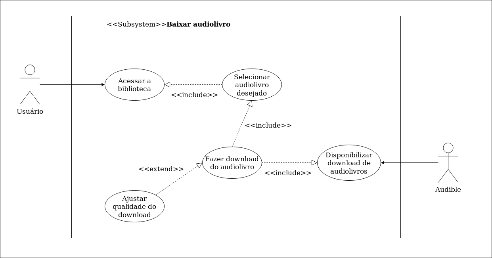

# Casos de Uso

## Introdução

Também chamados de diagramas comportamentais, na notação da UML, os casos de uso são usados para descrever um conjunto de ações (uses cases - casos de uso) que um sistema ou um conjunto de sistemas (subject - sujeito) deve desempenhar em colaboração com um ou mais indivíduos externos ao sistema (actors - atores). Cada caso de uso deverá prover algum resultado observável e de valor para os atores ou outros interessados do sistema.

## Casos de Uso e Especificações

#### 1 - Caso de Uso: Encontrar audiolivros por gênero

|         Sigla          |                                           Definição                                            |
| :--------------------: | -------------------------------------------------------------------------------------------- |
|         Versão         |       1.0                                      |
|         Autor          |     Murilo Loiola                              |
|       Descrição        |Categorização dos audiolivros na loja/biblioteca|
|          Ator           |  Audible Usuários                                       |
|   Pré-condições        | Um ou mais livros disponíveis na loja          |
|    Fluxo principal     |   - Criação de categorias/gêneros para os audiolivros   - Agrupamento dos audiolivros disponíveis na loja de acordo com as categorias   - Usuários filtram suas buscas de acordo com as categorias disponibilizadas               |
| Fluxo alternativo  |     **FA1 - Barra de pesquisa** - Usuário acessa o Audible - Usuário utiliza a barra de pesquisa para encontrar o livro desejado de forma mais rápida       |
|   Fluxo de exceções    |  **FE1 - Usuário não encontra o livro desejado** - Usuário pode utilizar a barra de pesquisa para pesquisar por autor/título                                             |
|     Pós condições      |    Facilitação da procura por audiolivros na área de interesse                                            |
|    Rastreabilidade     |   Baseado no Requisito Funcional 01 - A biblioteca/loja de audiolivros deve ser bem categorizada.          |

#### 2 - Caso de Uso: Comprar audiolivros

|         Sigla          | Definição       |
| :--------------------: | -------------------------------------------------------------------------------------------- |
|         Versão         |              1.0            |
|         Autor          |          Murilo Loiola      |
|       Descrição        |Audiolivros disponíveis na loja para serem comrprados|
|          Ator          |    Audible   Usuários   |
|   Pré-condições        |               Haver uma seção do aplicativo destinada a oferta de audiolivros (loja)               |
|    Fluxo principal     |      - Usuário acessa o Audible   - Usuário vai até a página da loja   - Usuário seleciona um audiolivro disponibilizado pela Audible  - Usuário efetua a compra                      |
| Fluxo alternativo      |   **FA2 - Lista de Desejos**     - Usuário acessa o Audible   - Usuário vai até sua lista de desejos   - Usuário seleciona um audiolivro que ele tenha salvo em sua lista de desejos   - Usuário efetua a compra    **FA3 - Assinatura** - Usuário possui assinatura na Audible - Usuário seleciona até dois livros - Os livros selecionados são adicionados a biblioteca do usuário                   |
|   Fluxo de exceções    |  **FE2 - Sem conexão com a internet**  - O aplicativo exibe a mensagem "Sem Conexão com a Internet"   **FE3 - Nenhum método de compra cadastrado**   - O aplicativo redireciona o usuário para a página de cadastro de método de pagamento               |
|     Pós condições      |  O audiolivro comprado pelo usuário é adicionado a sua biblioteca e pode ser consumido                           |
|    Rastreabilidade     |    Baseado no Requisito Funcional 02 - O aplicativo deve ofertar audiolivros         |

#### 3 - Caso de Uso: Baixar audiolivros

|         Sigla          |                                           Definição                                            |
| :--------------------: | -------------------------------------------------------------------------------------------- |
|         Versão         |            1.0           |
|         Autor          |     Murilo Loiola           |
|       Descrição        |Baixar audiolivros localmente para escutar sem conexão com a internet|
|          Ator          |        Audible Usuários     |
|   Pré-condições        |     - Usuário ter espaço de armazenamento livre na memória do dispositivo - Usuário conceder acesso ao aplicativo da Audible para *downloads* - Audible disponibilizar a *feature* de *download*      |
|    Fluxo principal     |  - Usuário seleciona o livro que deseja baixar a partir de sua biblioteca - Usuário confirma o *download* do audiolivro - Usuário aguarda o término do *download*               |
| Fluxo alternativo      | Não há  |
|   Fluxo de exceções    |    **FE4 - Sem conexão com a internet**  - O aplicativo exibe a mensagem "Sem Conexão com a Internet"  **FE5 - Sem espaço na memória do dispositivo** - A aplicativo informa ao usuário para que libere espaço na memória para efetuar o *download*      |
|     Pós condições      |    O usuário pode usufruir do audiolivro comprado a qualquer momento      |
|    Rastreabilidade     |                 Baseado no Requisito Funcional 03 - O usuário pode baixar os livros localmente para escutar mesmo off-line                   |

#### 4 - Caso de Uso: Barra de pesquisa

|         Sigla          |                                           Definição                                            |
| :--------------------: | -------------------------------------------------------------------------------------------- |
|         Versão         |                                  1.0                                   |
|         Autor          |                               Thallys                                  |
|       Descrição        |                  Ferramenta de pesquisa no Audible                     |
|          Ator          |                                  Usuários                                  |
|   Pré-condições    |                   Usuário ter acesso ao aplicativo                     |
|    Fluxo principal     |          Usuário acessar ao aplicativo e ir na barra de pesquisa            |
| Fluxo alternativo  |Usuário acessar o aplicativo, entrar na loja e ir na barra de pesquisa  |
|   Fluxo de exceções    |            Usuário não conseguir fazer login no aplicativo             |
|     Pós condições      |                 Usuário ver o audiolivro que pesquisou                 |
|    Rastreabilidade     |                 Baseado no Requisito Funcional 04 - O usuário tem que ter acesso a uma barra de pesquisa para poder pesquisar palavras-chaves, autores, títulos, narrador, editora                    |

#### 5 - Caso de Uso: Ambiente de Reprodução

|       Sigla       |                                                   Definição                                                    |
| :---------------: | ------------------------------------------------------------------------------------------------------------ |
|      Versão       |                                          1.0                                           |
|       Autor       |                                        Thallys                                         |
|     Descrição     |                  Ambiente para reprodução dos próprios audiolivros                    |
|       Ator        |                                        Usuário                                         |
|   Pré-condições   |                       Usuário já ter algum audiolivro comprado                         |
|  Fluxo Principal  |        Usuário acessar a biblioteca virtual e colocar para ouvir o audiolivro          |
| Fluxo Alternativo |Usuário acessar o aplicativo, entrar na loja, comprar o audiolivro e colocar para ouvir |
| Fluxo de exceções |       Usuário não ter nenhum audiolivro em sua biblioteca ou não conseguir ouvir       |
|   Pós condições   |                               Usuário ouvir o audiolivro                               |
|  Rastreabilidade  |                          Baseado no Requisito Funcional 05 - O aplicativo deve conter um ambiente para reprodução dos próprios audiolivros                           |

#### 6 - Caso de Uso: Variedade de livros

|       Sigla       |                                                Definição                                                |
| :---------------: | ----------------------------------------------------------------------------------------------------- |
|      Versão       |                                      1.0                                        |
|       Autor       |                                    Thallys                                      |
|     Descrição     |           Deve haver variedade de livros disponíveis para o usuário.            |
|       Ator        |                                    Usuário                                      |
|   Pré-condições   |                        Variedade de livros disponíveis                          |
|  Fluxo Principal  |            Usuário acessar a loja e ter acesso a todos audiolivros              |
| Fluxo Alternativo |Usuário acessar o aplicativo, entrar na loja e consultar os livros por categoria |
| Fluxo de exceções |                      Usuário não conseguir acessar a loja                       |
|   Pós condições   |                     Usuário escolher o audiolivro desejado                      |
|  Rastreabilidade  |                      Baseado no Requisito Funcional 06 - Deve haver variedade de livros disponíveis para o usuário                        |

#### 7- Caso de Uso: Assinar o Audible

|Sigla|Definição|
|:---:|---|
|Versão|1.0|
|Autor|André Goretti|
|Descrição|Assinar o Audible para ter todos os livros disponíveis|
|Ator|Usuários
|Pré-Condições|Ter conta na Amazon|
|Fluxo principal|Entrar no site e assinar|
|Fluxo alternativo|Entrar nos dados de perfil e adicionar a assinatura|
|Fluxo de exceções|Não conseguir pagar pela assinatura|
|Pós condições|Ter acesso a alguns audiolivros disponibilizados pela Audible mensalmente|
|Rastreabilidade| RF05 do Questionário|

#### 8- Uso de caso: Salvar o progresso do livro

|Sigla|Definição|
|:---:|---|
|Versão|1.0|
|Autor|André Goretti|
|Descrição|O usuário deve ser capaz de retomar o livro de onde parou|
|Ator|Usuários|
|Pré-Condições|Ter acesso aos livros|
|Fluxo principal|Entrar no livro que ja possui e continuar a ouvir|
|Fluxo alternativo|Não existe|
|Fluxo de exceções|Não estar logado na conta certa|
|Pós condições|ouvir o livro de onde foi parado|
|Rastreabilidade| RF07 do Brainstorm|

#### 9- Uso de caso: Avaliação de livros

|Sigla|Definição|
|:---:|---|
|Versão|1.0|
|Autor|André Goretti|
|Descrição|Ter as avaliações aparentes|
|Ator|Usuários
|Pré-Condições|nenhum|
|Fluxo principal|Entrar no site e pesquisar o livro que deseja ver a recomendação|
|Fluxo alternativo|pesquisar entre livros semelhante com avaliações boas|
|Fluxo de exceções|Não ter uma avaliação prévia do livro|
|Pós condições|Saber a qualidade do livro|
|Rastreabilidade| RF03 do Questionário|