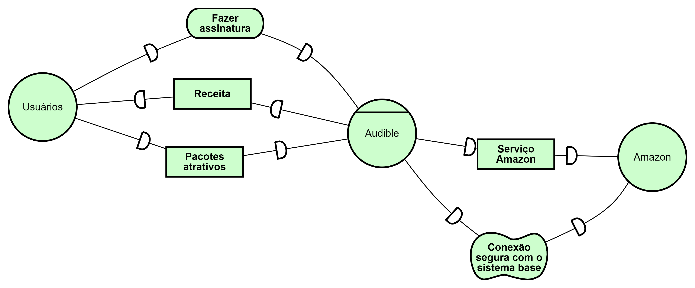
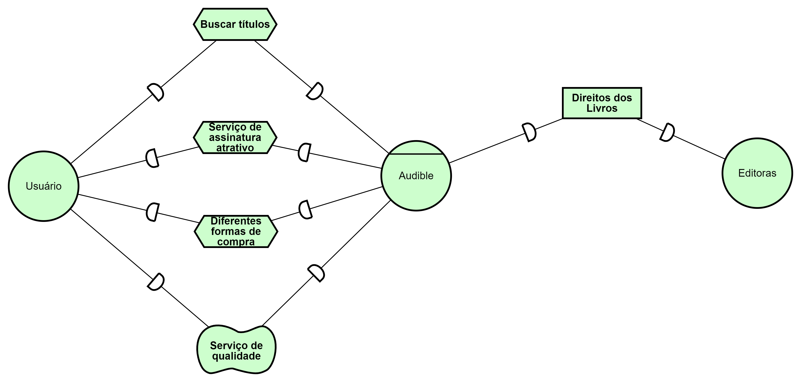
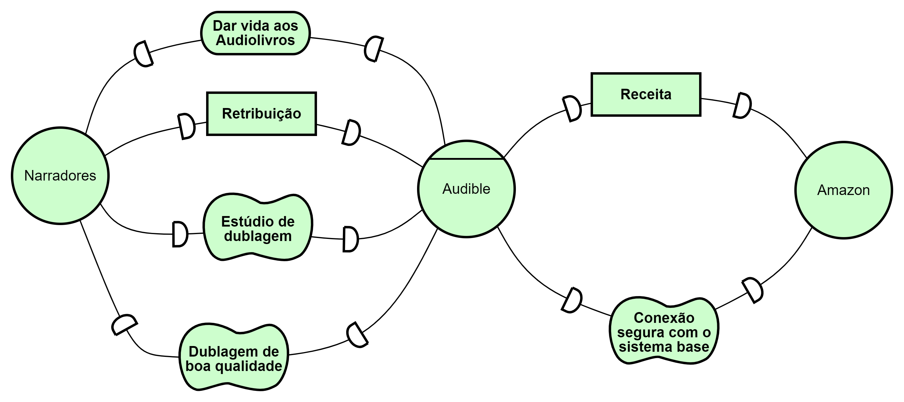
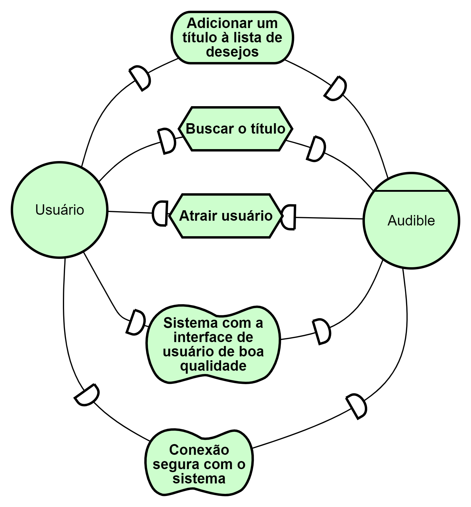
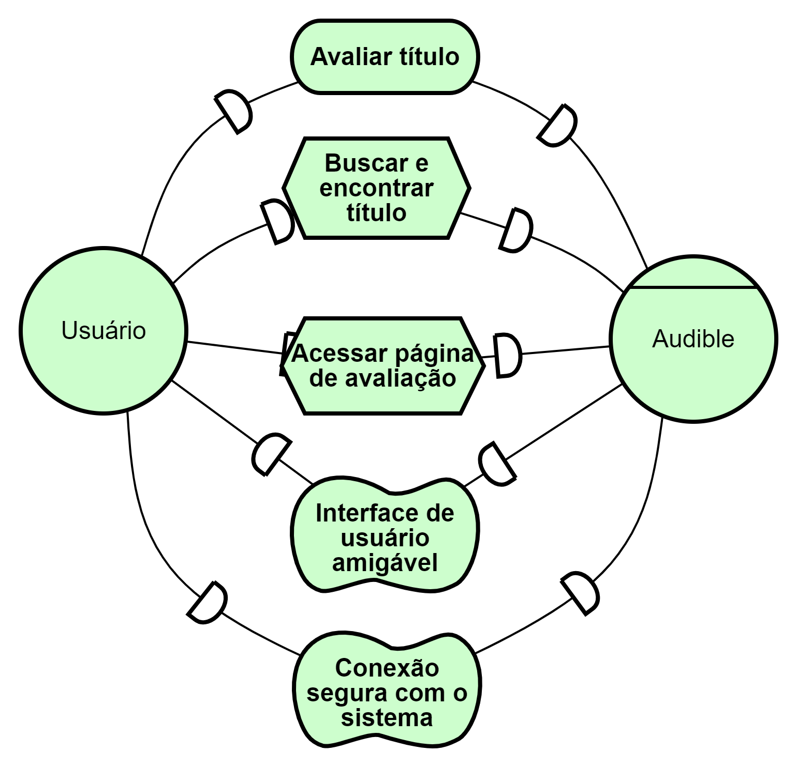
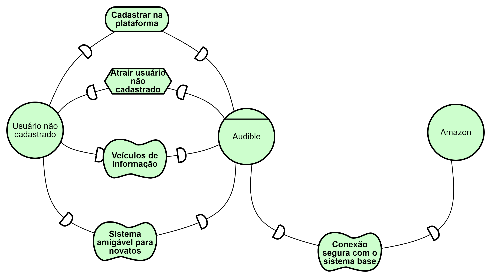
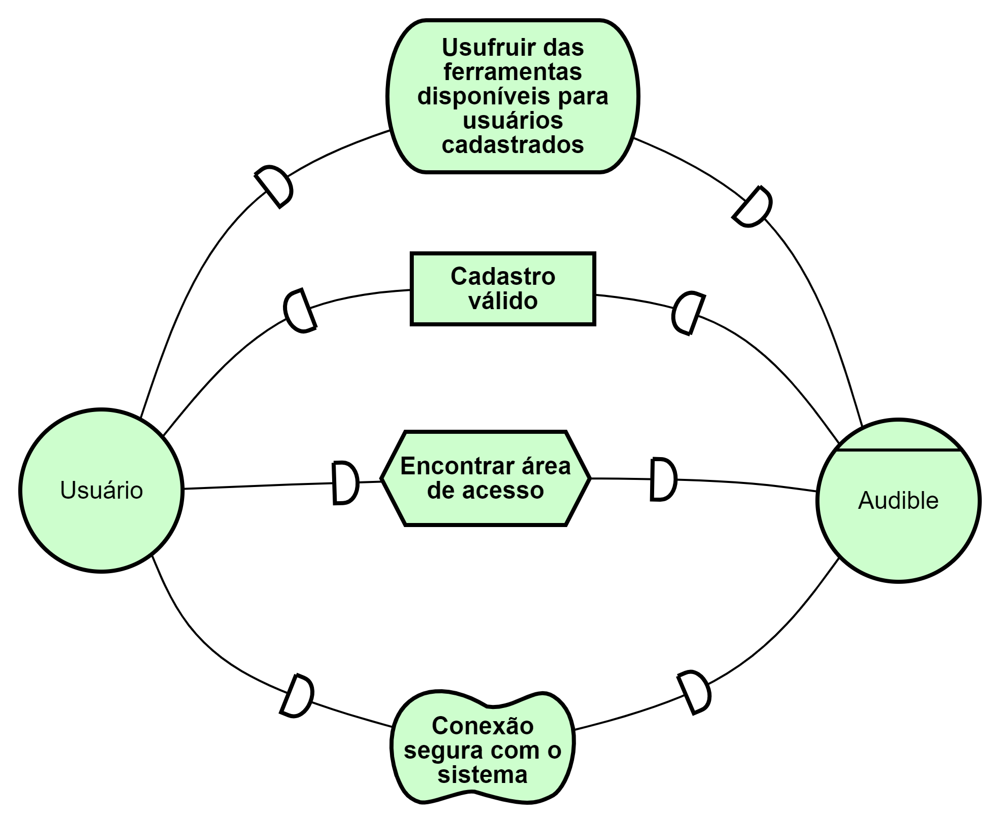

# iStar
## Versionamento
| Versão | Data | Modificação | Autor |
| ------ | ---- | ----------- | ----- |
| 1.0 | 29/09/2019 | iStar | [João Gabriel](https://github.com/flyerjohn) |
| 1.1 | 29/09/2019 | Adição dos modelos iStar da Avaliação, Cadastro, Login e Lista de Desejos. | [João Gabriel](https://github.com/flyerjohn) |

## Introdução

&emsp;&emsp;O iStar ou i* é um documento com o objetivo de identificar e representar as dependências existentes entre os diferentes atores que atuam no sistema, bem como as metas, recursos ligados a cada um desses atores, de forma a evidenciar cada cenário estudado.

## Modelos
### Assinatura

### Busca

### Dublagem

### Lista de Desejos

### Avaliação

### Cadastro

### Login

