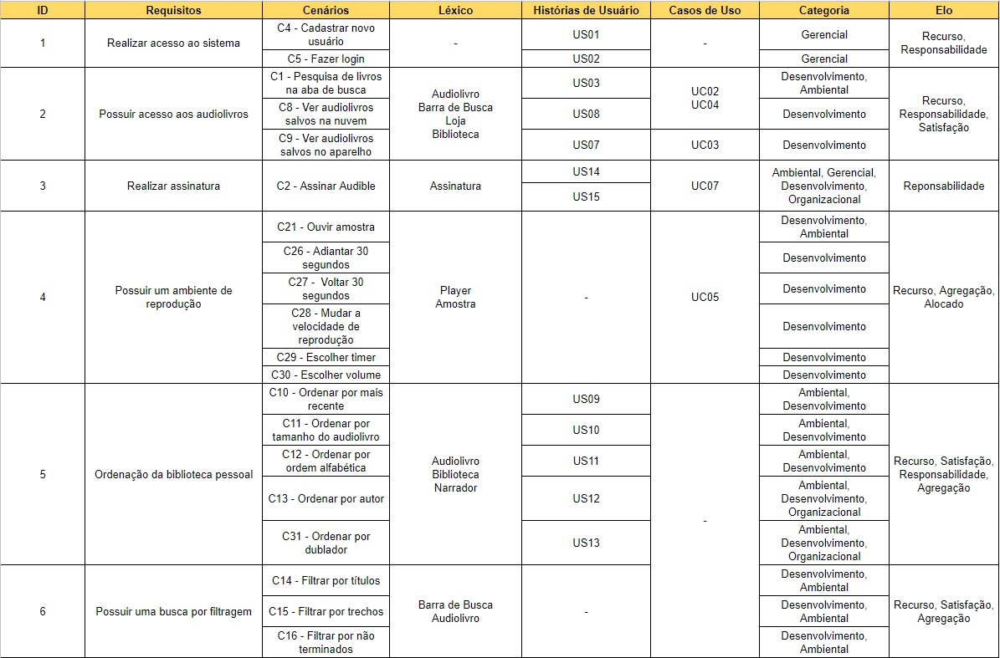

# Matriz Forward-From
## Versionamento
| Versão | Data | Modificação | Autor |
| :---: | :---: | :---: | :---: |
| 1.0 | 17/11/2019 | Adição do artefato. | [João Gabriel](https://github.com/flyerjohn) |

## Introdução

&emsp;&emsp;Em termos gerais, A Matriz Forward-From é a matriz que representa a ligação dos requisitos aos artefatos de desenho e implementação do sistema. 
O modelo escolhido pela equipe foi o Meta-Modelo de Toranzo, que utiliza as classificações abaixo:

* Ambiental: informações oriundas do contexto no qual a organização está inserida.
* Organizacional: informações pertencentes à organização, como a missão, os objetivos e as estratégias.
* Gerencial: informações que auxiliam a gerência do projeto.
* Desenvolvimento: informações associadas aos diversos artefatos gerados ao longo do processo de desenvolvimento.

## Matriz

