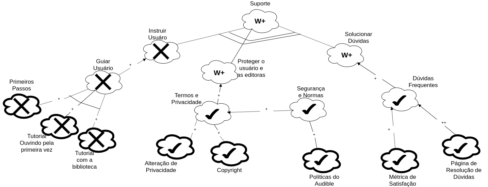

# NFR Framework

## Versionamento

| Versão |    Data    |  Modificação   |                                                                    Autor                                                                    |
| :----: | :--------: | :------------: | :-----------------------------------------------------------------------------------------------------------------------------------------: |
|  1.0   | 21/10/2019 | Adição dos NFR | [Ian Rocha](https://github.com/IanPSRocha), [Murilo Loiola](https://github.com/murilo-dan) e [Thallys Braz](https://github.com/thallysbraz) |

## Introdução

&emsp;&emsp;"O NFR Framework é uma abordagem orientada a processos, onde os requisitos não funcionais são explicitamente representados como metas a serem obtidas" [CHUNG, 1995]. De forma simplificada, o NFR Framework busca decompor as metas destacadas anteriormente em seus componentes mais básicos, além de relacionar as dependências entre cada meta, favorecendo o entendimento de **como** o sistema faz algo, ao invés de **o que** ele faz. Normalmente, são apresentados em forma de gráfico.

&emsp;&emsp;Para fazer a análise das propagações, foi levado em consideração as tecnologias e ferramentas que já são utilizadas pelo aplicativo.
Obs: Clique nas imagens para ampliar.

## NFR's

### NFR Geral

| **NFR00**           | **Geral**                                                |
| ------------------- | -------------------------------------------------------- |
| **Versão**          | Atual: 1.0                                               |
| **Rastreabilidade** | [Especificação Suplementar](suplementar.md) |

### NFR01 - Portabilidade

### Propagação - NFR01

### NFR02 - Usabilidade

### Propagação - NFR02

### NFR03 - Suporte

### Propagação - NFR03

### NFR04 - Confiabilidade

### Propagação - NFR04

### NFR05 - Desempenho

### Propagação - NFR05

