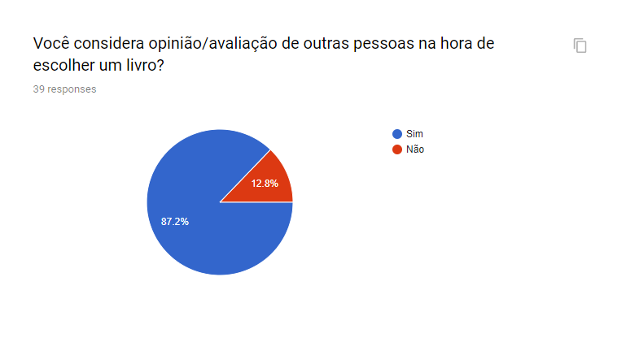

# Questionário
## Versionamento
| Versão | Data | Modificação | Autor |
| :---: | :---: | :---: | :---: |
|1.0 |12/09/2019 |Questionário | [João Gabriel Antunes](https://github.com/flyerjohn) |

## Introdução

&emsp;&emsp;O questionário é uma ótima maneira de elicitar requisitos, pois com ele é fácil saber qual as principais características e necessidades do público alvo, além, claro, de delinear este público.

## Questões
### Questão 1

### Questão 2

### Questão 3

### Questão 4

### Questão 5

### Questão 6

### Questão 7

### Questão 8

### Questão 9

### Questão 10

## Requisitos Elicitados
### Requisitos Funcionais
| Código | Descrição | Prioridade |
|--|--|--|
| RF01 | Salvar biblioteca pessoal na nuvem. | Must |
| RF02 | O aplicativo deve ofertar audiolivros. | Must |
| RF03 | Avaliação de livros disponível amplamente. | Should |
| RF04 | Busca de livros por narrador. | Could |
| RF05 | Serviço de assinatura para acesso ilimitado de livros. | Would |

### Requisitos Não Funcionais
| Código | Descrição | Prioridade |
|--|--|--|
| RNF01 | Maior acessibilidade em toda a aplicação. | Should |
| RNF02 | Grande variedade de livros. | Could |
| RNF03 | Áreas de descoberta de novos livros baseada nos gostos do usuário. | Would |
| RNF04 | Sistema ter maneiras de incentivar a leitura ao usuário. | Would |
