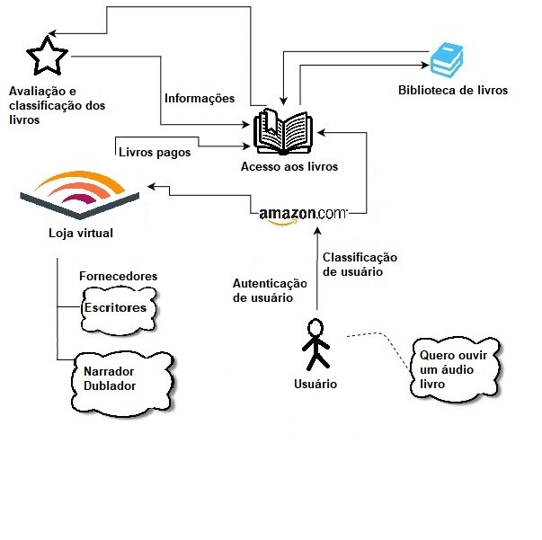
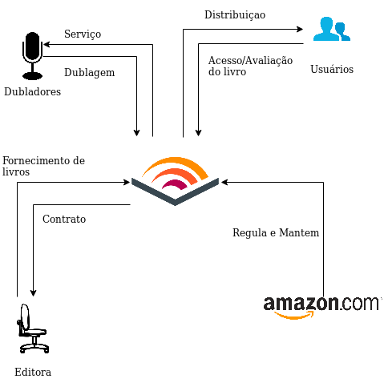
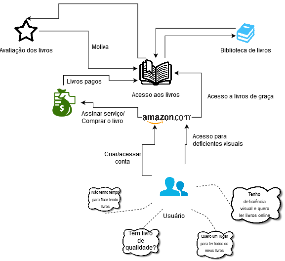
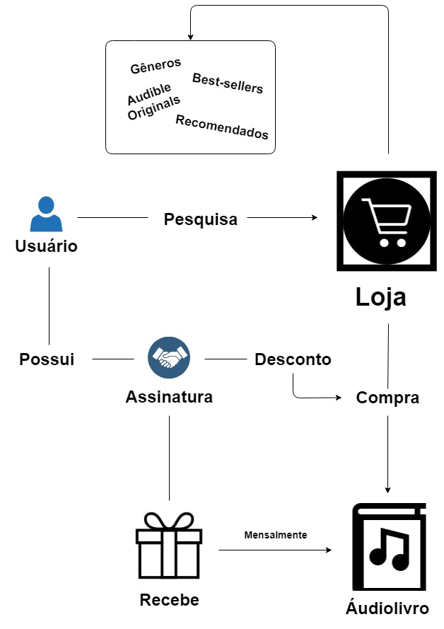
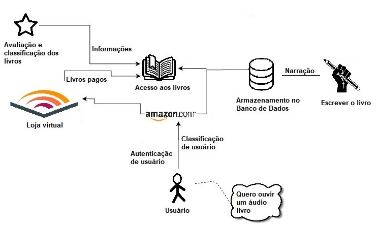
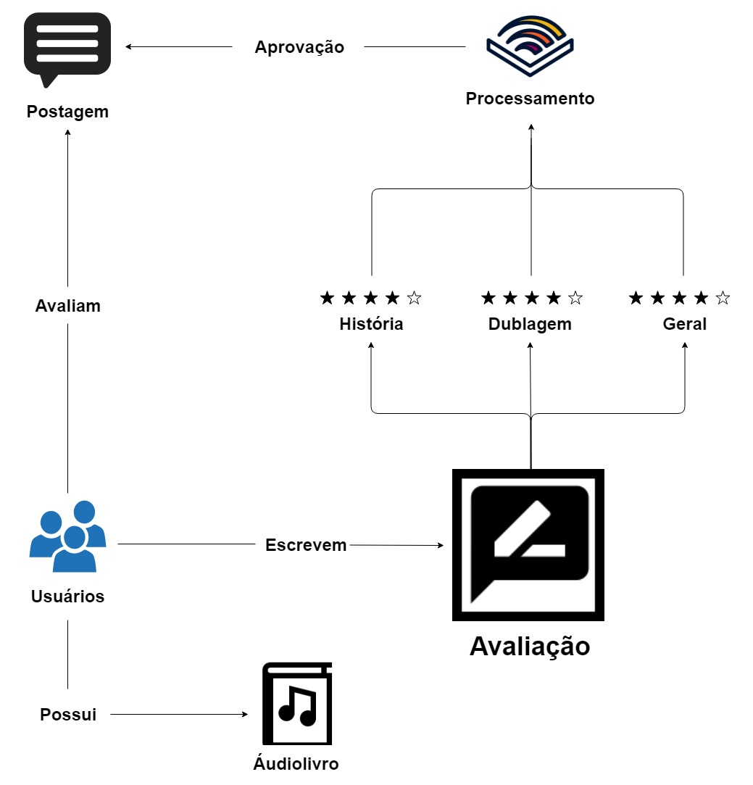

# Rich Picture
## Versionamento
| Versão | Data | Modificação | Autor |
| :---: | :---: | :---: | :---: |
| 1.0 | 27/08/2019 | Adição do [RP1](#rp1-) |  |
| 1.1 | 27/08/2019 | Adição do [RP2](#rp2-) |  |
| 1.2 | 27/08/2019 | Adição do [RP3](#rp3-) |  |
| 2.0 | 30/10/2019 | Adição dos RichPictures restantes |  |

## Introdução

&emsp;&emsp;O Rich Picture é uma técnica de requisitos de software, elaborada na fase de pré-rastreabilidade. São desenho feitos a mão ou digitalmente a fim de expressar ideias, que representam um subsistema de um sistema maior. É um artefato considerado informal e muito útil na identificação das partes envolvidas, a fim abrir espaço para discussões e ser uma forma de compreender o problema amplamente.

## RP1 - Geral

## RP2 - Atores

## RP3 - Usuários

## RP4 - Loja

## RP5 - Livro

## RP6 - Avaliação

