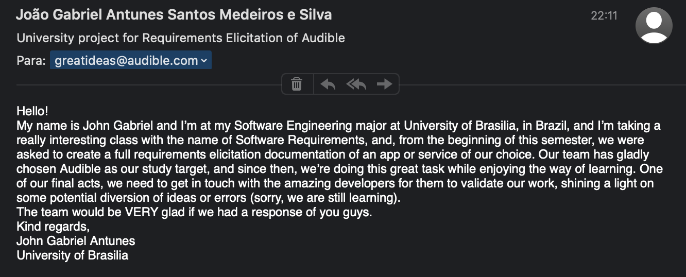
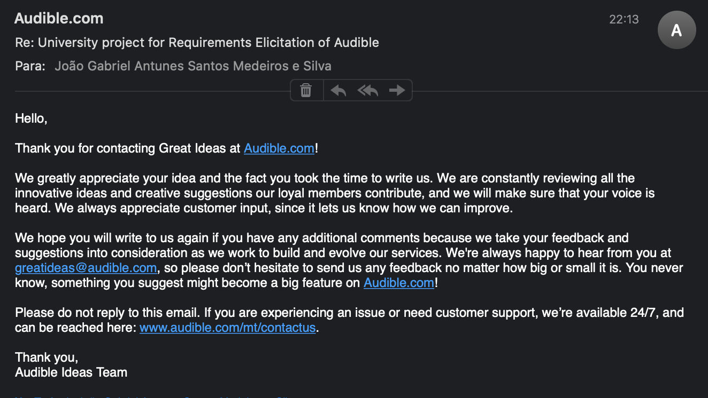
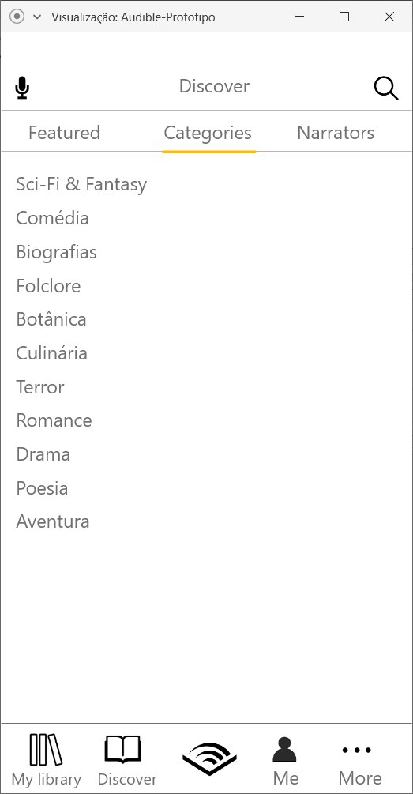
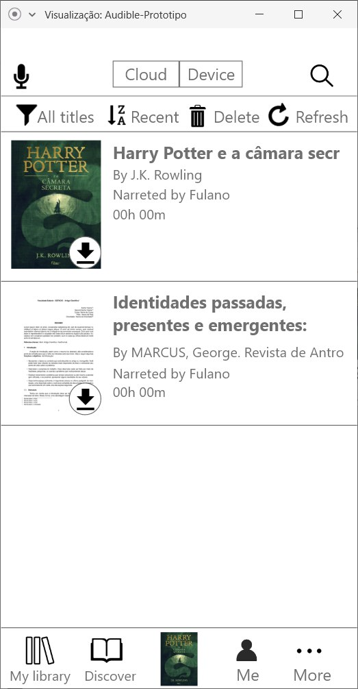
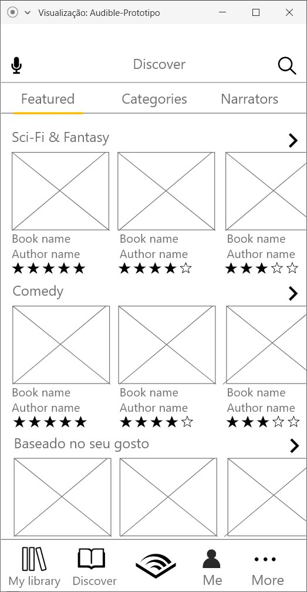
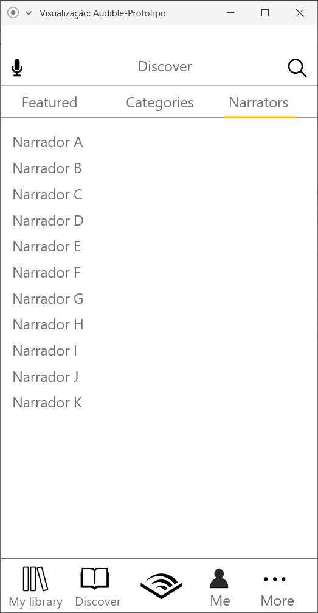
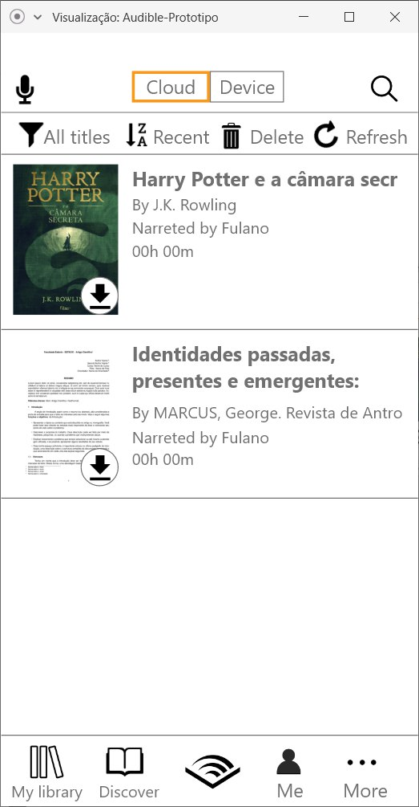
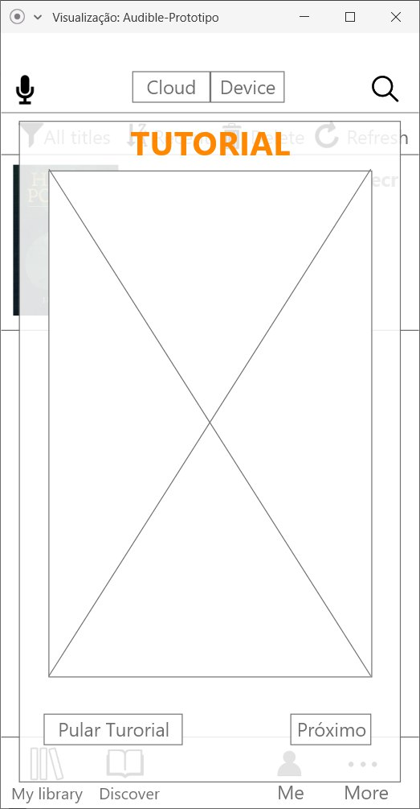
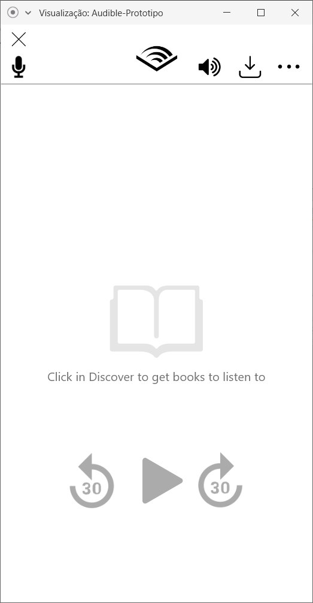

## Introdução

&emsp;&emsp;A validação de software, ou seja, a confirmação de que o produto é aquele desejado pelo usuário, ocorre, normalmente, no fim do ciclo de vida. Resumidamente para o nosso caso, supondo que a elicitação foi feita corretamente de acordo com os modelos propostos (e, quando não feita corretamente, percebe-se e corrige na parte de verificação), espera-se que  produto atenda perfeitamente às necessidades do cliente. No entanto, isso dificilmente ocorre. Assim sendo, a validação tem o objetivo de verificar se as necessidades foram atendidas e, se não, quais não foram.

## Metodologia

&emsp;&emsp;Inicialmente, o grupo optou por utilizar a Validação Informal. Essa estratégia trata-se de verificar diretamente com os stakeholders se o produto realmente atende ao que eles desejam. O problema é que nem sempre os stakeholders possuem o conhecimento para analisar o que foi desenvolvido.

&emsp;&emsp;Assim, no contexto da disciplina de Requisitos, o ideal seria entrar em contato direto com os desenvolvedores do aplicativo, para que eles validem o que foi realizado. Para o nosso grupo (Audible), os desenvolvedores são da Amazon, uma das maiores multinacionais que existem.

&emsp;&emsp;Com isso em mente, o grupo tentou estabelecer contato através do e-mail "greatideas@audible.com", disponibilizado pela Audible para sugestões de ideias para o aplicativo. Acrediitamos que este seja o modo mais eficaz de contato, visto que através da nossa análise de requisitos, é possível perceber melhoras que podem ser feitas no aplicativo. No entanto, até o momento, não obtivemos respostas.

&emsp;&emsp;O grupo está ponderando sobre outras formas de validação, como a Prototipagem e a Validação Baseada em Ponto de Vista, para o caso de a tentativa de contato não ser bem sucedida.

## Validação 2.0

&emsp;&emsp;Visto que o grupo não obteve resposta para o e-mail enviado, não foi possível realizar a Validação Informal. Dessa forma, o grupo optou por fazer um protótipo para validar os requisitos elicitados. Seguem imagens das telas do protótipo feito. Novas telas serão adicionadas conforme o grupo perceber novos requisitos.

####[O usuário deve ser capaz de avaliar o audiolivro de acordo com sua experiência.	](https://requisitos-de-software.github.io/2019.2-Audible/brainstorm/#requisitos-nao-funcionais)

####[A biblioteca/loja de audiolivros deve ser bem categorizada.](https://requisitos-de-software.github.io/2019.2-Audible/brainstorm/#requisitos-funcionais)

####[A biblioteca/loja de audiolivros deve ser bem categorizada.](https://requisitos-de-software.github.io/2019.2-Audible/brainstorm/#requisitos-funcionais)

####[O aplicativo deve ofertar audiolivros.](https://requisitos-de-software.github.io/2019.2-Audible/brainstorm/#requisitos-funcionais)

####[Busca de livros por narrador.](https://requisitos-de-software.github.io/2019.2-Audible/questionario/#requisitos-funcionais)

####[Salvar biblioteca pessoal na nuvem.](https://requisitos-de-software.github.io/2019.2-Audible/questionario/#requisitos-funcionais)

####[O aplicativo deve conter um ambiente para reprodução dos próprios audiolivros.](https://requisitos-de-software.github.io/2019.2-Audible/brainstorm/#requisitos-funcionais)

####[O usuário tem acesso a uma prévia do livro antes de efetuar a compra.](https://requisitos-de-software.github.io/2019.2-Audible/brainstorm/#requisitos-funcionais)

####[Adição de um tutorial de como usar o aplicativo.](https://requisitos-de-software.github.io/2019.2-Audible/introspeccao/#requisitos-levantados_1)

####[O usuário deve ser capaz de personalizar a reprodução do áudio livro (ex: acelerar/reduzir a velocidade de reprodução).](https://requisitos-de-software.github.io/2019.2-Audible/brainstorm/#requisitos-nao-funcionais)

####[Áreas de descoberta de novos livros baseada nos gostos do usuário.](https://requisitos-de-software.github.io/2019.2-Audible/questionario/#requisitos-nao-funcionais)

## Versionamento
| Versão | Data | Modificação | Autor |
|--|--|--|--|
|1.0 | 05/11 | Criação do documento | [João Gabriel Antunes](https://github.com/flyerjohn), [Murilo Loiola](https://github.com/murilo-dan) |
|2.0 | 25/11 | Atualização com protótipo | [Murilo Loiola](https://github.com/murilo-dan) |
