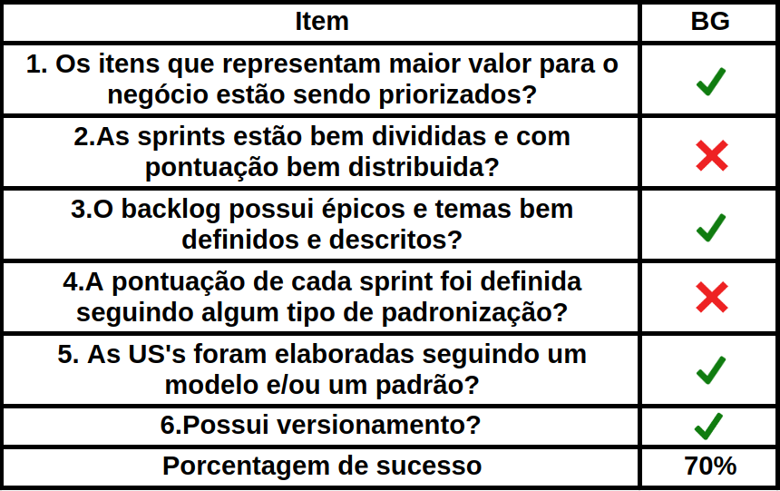

# Backlog

## Introdução

A verificação do backlog tem como objetivo analisar, detectar e detalhar possíveis erros e hiatos de informações cometidos durante a elicitação do tal artefato analisado, afim de corrigi-los o quanto antes, para que o processo de desenvolvimento e produção possa continuar sem quaisquer falhas nos processos anteriores, para assim manter se uma ótima qualidade no produto final. Para tal atividade, a confecção de um *checklist* foi escolhida a mais adequada e eficaz. Os pontos do *checklist* foram elaborados a partir de, principalmente, O Guia do Scrum Oficial - Ken Schwaber e Jeff Sutherland.

## Metodologia 
O Backlog do Produto é, de fato, um artefato bem extenso, e, por isso, o time decidiu por fazer dois *checklists*, um com o objetivo de analisar o artefato como um todo, e outro com o objetivo de analisar as Histórias de Usuário.

## Checklist
### Backlog Geral

### Histórias de Usuário

## Observações

| US | Observações |
| ------- | ----------- |
|  Todas  | Revisar todas as histórias de usuário e pontuá-las quanto às sprints |
| US01 | Especificar métodos de cadastro |
| US02 | Especificar métodos de login |
| US09 | Adicionar especificações de pacotes de assinatura |
| US15 | Apontar a possibilidade de conseguir amostra do título desejado |

## Conclusão

Pela análise feita a partir dos CheckLists, os modelos gerados pelo grupo para o Audible ficaram bons. O que mais esteve ausente nos modelos foram os versionamentos e a falta de rastreabilidade, juntamente com alguns casos em que o objetivo das *US's* não estavam claros como deveriam. As causas prováveis são falta de atenção em relação aos artefatos já elicitados e tempo de produção.

## Referências

[Official Scrum Guide - 2013](https://drive.google.com/open?id=1Zfvkr31czbRt_1SecL3SMBDI84VzsiCZ)

[Requisitos Não Funcionais: Da Elicitação ao Modelo Conceitual](https://drive.google.com/open?id=1Rc-_Z6yYWsl3UBY2ml8oDADKp0tgmwaV)

## Versionamento 

| Data | Versão | Descrição | Autor |
| ---- | ------ | --------- | ----- |
| 04/11/2019 | 1.0 | Confeccionando artefato de verificação | [João Gabriel Antunes](https://github.com/flyerjohn) |