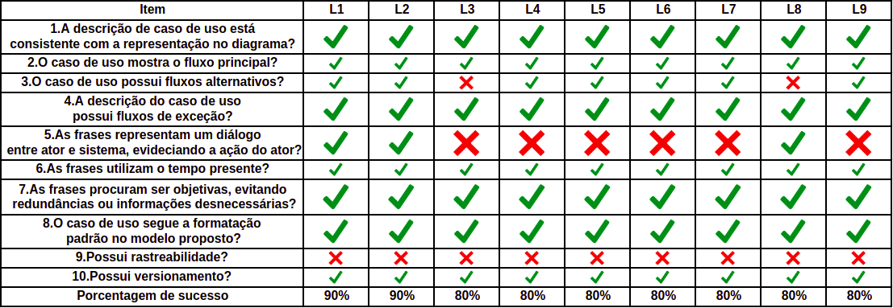

# Casos de Uso

## Introdução 

Este documento tem como objetivo relatar a detecção de defeitos nos artefatos referentes aos Casos de USo produzidos pelo grupo durante a etapa de modelagem. Para este fim, a utilização de um checklist mostrou-se a maneira mais clara e eficaz para encontrar possíveis falhas. Nos checklists elaborados, buscou-se uma forma de padronizar a verificação dos artefatos requeridos, utilizando questões pertinentes para o conjunto.

## Checklist

## Observações

| Caso de Uso | Observações |
| ------- | ----------- |
|  Todos  | Revisar todos os léxicos e adicionar rastreabilidade aonde se prova necessário|
|   CDU3    | Adicionar fluxo alternativo e evidenciar o sistema |
|   CDU4    | Evidenciar o Sistema |
|   CDU5    | Evidenciar o Sistema |
|   CDU6    | Evidenciar o Sistema |
|   CDU7    | Evidenciar o Sistema |
|   CDU8    | Adicionar fluxo alternativo |
|   CDU9    | Evidenciar o Sistema |

## Conclusão 

Pela análise feita a partir dos CheckLists, os modelos gerados pelo grupo para o Audible ficaram bons. O que mais esteve ausente nos modelos foram a falta de rastreabilidade, juntamente com alguns casos em que não havia um sistema dialogando com o ator. As causas prováveis são questões de tempo, atenção ou alinhamento com os outros membros.

## Referências

Gregolin, Rosângela. Uma proposta de inspeção em modelos de caso de uso. 2007. Disponível em: http://cassiopea.ipt.br/teses/2007_EC_Rosangela_Gregolin.pdf. 

## Versionamento 

| Data | Versão | Descrição | Autor |
| ---- | ------ | --------- | ----- |
| 04/11/2019 | 1.0 | Adicionando Verificação | [Ian Rocha](https://github.com/IanPSRocha) |