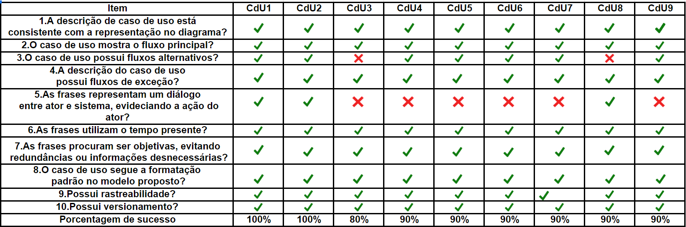

# Casos de Uso

## Introdução

&emsp;&emsp;Este documento tem como objetivo relatar a detecção de defeitos nos artefatos referentes aos Casos de Uso produzidos pelo grupo durante a etapa de modelagem. Para este fim, a utilização de um checklist mostrou-se a maneira mais clara e eficaz para encontrar possíveis falhas. Nos checklists elaborados, buscou-se uma forma de padronizar a verificação dos artefatos requeridos, utilizando questões pertinentes para o conjunto.

## Checklist

## Observações

| Caso de Uso | Observações |
| :-------: | ----------- |
|  Todos  | - Revisar todos os léxicos e adicionar rastreabilidade aonde se prova necessário|
|   CDU3    | - Adicionar fluxo alternativo e evidenciar o sistema |
|   CDU4    | - Evidenciar o sistema |
|   CDU5    | - Evidenciar o sistema |
|   CDU6    | - Evidenciar o sistema |
|   CDU7    | - Evidenciar o sistema |
|   CDU8    | - Adicionar fluxo alternativo |
|   CDU9    | - Evidenciar o sistema |

## Conclusão

&emsp;&emsp;Pela análise feita a partir dos checkLists, os modelos gerados pelo grupo para o Audible ficaram bons. A falha mais notável nos modelos foi a falta de rastreabilidade, juntamente com alguns casos em que não havia um sistema dialogando com o ator. As causas prováveis são: questões de tempo, atenção ou alinhamento com os outros membros.

## Autores
| Nome | Função |
| ---- | ------ |
| Thallys Braz | Autor, Inspetor |
| André Goretti | Leitor, Inspetor |

## Referências

<a href="http://cassiopea.ipt.br/teses/2007_EC_Rosangela_Gregolin.pdf">Gregolin, Rosângela. Uma proposta de inspeção em modelos de caso de uso. 2007.</a> 
<a href="https://fga-disciplinas.github.io/2019.1-Guia-Bolso/analise/analise_casos_de_uso/">Página de verificação dos Casos de Uso do grupo GuiaBolso - 2019.1</a> 
<a href="https://requisitos-habitica.netlify.com/">Página do grupo Habitica - 2019.1</a>

## Versionamento

| Data | Versão | Descrição | Autor |
| ---- | ------ | --------- | ----- |
| 04/11/2019 | 1.0 | Adicionando Verificação | [Ian Rocha](https://github.com/IanPSRocha) |
| 04/11/2019 | 1.1 | Atualizando quadro | [Murilo Loiola](https://github.com/murilo-dan) |
