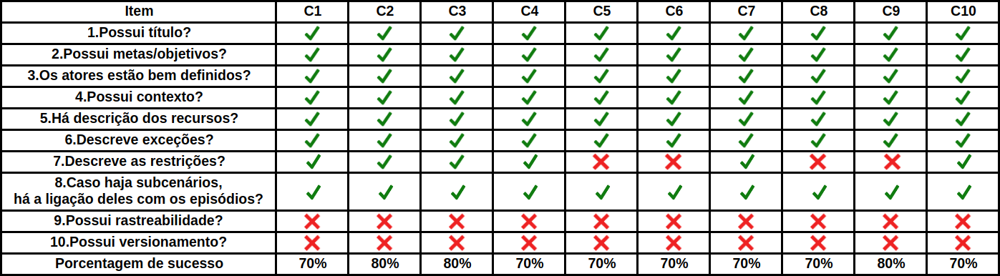

# Cenários

## Introdução

Este documento tem como objetivo relatar a detecção de defeitos nos artefatos referentes aos Cenários produzidos pelo grupo durante a etapa de modelagem. Para este fim, a utilização de um checklist mostrou-se a maneira mais clara e eficaz para encontrar possíveis falhas. Nos checklists elaborados, buscou-se uma forma de padronizar a verificação dos artefatos requeridos, utilizando questões pertinentes para o conjunto.

## Checklist

## Observações

| Cenário | Observações |
| ------- | ----------- |
|  Todos  | Revisar todos os cenários e adicionar rastreabilidade aonde se prova necessário, já ajudando no versionamento |
|   C5 / C6 / C8 / C9    | Adicionar Restrições |
|   C17 / C20 / C21 / C24    | Adicionar Restrições |
|   C25 / C26 / C27 / C28 / C30    | Adicionar Restrições |

## Conclusão

Pela análise feita a partir dos CheckLists, os modelos gerados pelo grupo para o Audible ficaram bons. O que mais esteve ausente nos modelos foram os versionamentos e a falta de rastreabilidade, juntamente com alguns casos em que não havia restrições. As causas prováveis são questões de tempo, atenção ou alinhamento com os outros membros.

## Versionamento 

| Data | Versão | Descrição | Autor |
| ---- | ------ | --------- | ----- |
| 04/11/2019 | 1.0 | Adicionando Verificação | [Ian Rocha](https://github.com/IanPSRocha) |