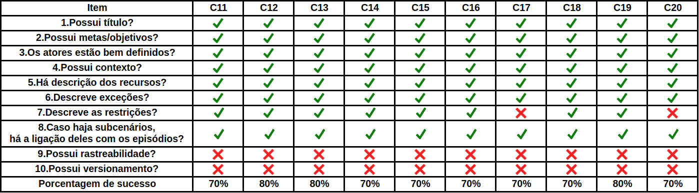

# Cenários

## Introdução

&emsp;&emsp;Este documento tem como objetivo relatar a detecção de defeitos nos artefatos referentes aos Cenários produzidos pelo grupo durante a etapa de modelagem. Para este fim, a utilização de um checklist mostrou-se a maneira mais clara e eficaz para encontrar possíveis falhas. Nos checklists elaborados, buscou-se uma forma de padronizar a verificação dos artefatos requeridos, utilizando questões pertinentes para o conjunto.

## Checklist

## Observações

| Cenário | Observações |
| :-------: | ----------- |
|  Todos  | - Revisar todos os cenários e adicionar rastreabilidade onde seja necessário, ajudando no versionamento |
|   C5 / C6 / C8 / C9    | - Adicionar restrições |
|   C17 / C20 / C21 / C24    | - Adicionar restrições |
|   C25 / C26 / C27 / C28 / C30    | - Adicionar restrições |

## Conclusão

&emsp;&emsp;Pela análise feita a partir dos checkLists, os modelos gerados pelo grupo para o Audible ficaram bons. A falha mais notável nos modelos foi a falta de rastreabilidade, juntamente com vários casos em que não havia restrições. As causas prováveis são: questões de tempo, atenção ou alinhamento com os outros membros.

## Autores
| Nome | Função |
| ---- | ------ |
| André Goretti | Autor, Inspetor |
| Murilo Loiola | Leitor, Inspetor |

## Referências

<a href="https://fga-disciplinas.github.io/2019.1-Guia-Bolso/analise/analise_cenarios/">Página de verificação dos Cenários do grupo GuiaBolso - 2019.1</a> 
<a href="https://requisitos-habitica.netlify.com/">Página do grupo Habitica - 2019.1</a>

## Versionamento

| Data | Versão | Descrição | Autor |
| ---- | ------ | --------- | ----- |
| 04/11/2019 | 1.0 | Adicionando Verificação | [Ian Rocha](https://github.com/IanPSRocha) |
| 04/11/2019 | 1.1 | Atualizando quadro | [Murilo Loiola](https://github.com/murilo-dan) |
