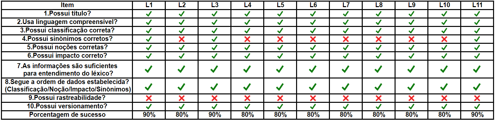

# Léxicos

## Introdução

Este documento tem como objetivo relatar a detecção de defeitos nos artefatos referentes aos Léxicos produzidos pelo grupo durante a etapa de modelagem. Para este fim, a utilização de um checklist mostrou-se a maneira mais clara e eficaz para encontrar possíveis falhas. Nos checklists elaborados, buscou-se uma forma de padronizar a verificação dos artefatos requeridos, utilizando questões pertinentes para o conjunto.

## Checklist

## Observações

| Léxico | Observações |
| ------- | ----------- |
|  Todos  | Revisar todos os léxicos e adicionar rastreabilidade aonde se prova necessário, já ajudando no versionamento |
|   L1    | Adicionar Sinônimos |
|   L4    | Adicionar Sinônimos |
|   L5    | Corrigir Sinônimos |
|   L6    | Adicionar Sinônimos |
|   L7    | Adicionar Sinônimos |
|   L8    | Adicionar Sinônimos |
|   L9    | Adicionar Sinônimos |
|   L10   | Adicionar Sinônimos |

## Conclusão

Pela análise feita a partir dos CheckLists, os modelos gerados pelo grupo para o Audible ficaram bons. O que mais esteve ausente nos modelos foram os versionamentos e a falta de rastreabilidade, juntamente com alguns casos em que não havia sinônimos ou  estavam errados. As causas prováveis são questões de tempo, atenção ou alinhamento com os outros membros.

## Versionamento 

| Data | Versão | Descrição | Autor |
| ---- | ------ | --------- | ----- |
| 04/11/2019 | 1.0 | Adicionando Verificação | [Ian Rocha](https://github.com/IanPSRocha) |