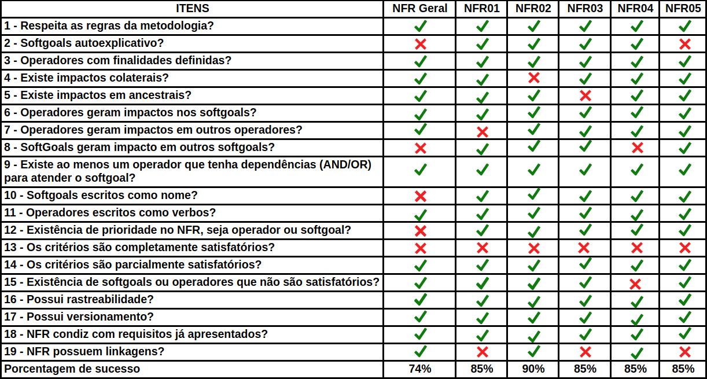

# NFR

## Introdução

&emsp;&emsp;Este documento tem como objetivo relatar a detecção de defeitos nos artefatos referentes aos <a href="https://requisitos-de-software.github.io/2019.2-Audible/nfr/">NFR's</a> produzidos pelo grupo durante a etapa de pré-rastreabilidade. Para este fim, a utilização de um checklist mostrou-se a maneira mais clara e eficaz para encontrar possíveis falhas. Nos checklists elaborados, buscou-se uma forma de padronizar a verificação dos artefatos requeridos, utilizando questões pertinentes para o conjunto.

## Checklist

## Observações
| RichPicture | Observações |
| :---------: | ----------- |
|NFR00 - Geral| - Softgoals não são destacados.  - Relação não estão explicítas.|
|NFR01 - Portabilidade| - Operações não se relacionam.  - Critérios não bem definidos. |
|NFR02 - Usabilidade| - Impactos colaterias não estão destacados.   - Critérios não bem definidos. |
|NFR03 - Suporte| - Não há linkagem.  - Critérios não bem definidos. |
|NFR04 - Confiabilidade| - Alguns softgoals não são bem distinguidas de operações. - Critérios não bem definidos. |
|NFR05 - Desempenho| - Alguns softgoals não são autoexplicativos.  - Critérios não bem definidos. |

## Resultados

&emsp;&emsp;Pela análise feita, percebemos que há uma falta de padronização no desenvolvimento dos NFR's. Isso se dá provavelmente devido a complexidade do artefato. Serão planejadas refatorações para o futuro.

## Autores
| Nome | Função |
| ---- | ------ |
| Thallys Braz | Autor, Inspetor |
| André Goretti | Leitor, Inspetor |

## Referências

<a href="https://fga-disciplinas.github.io/2019.1-Guia-Bolso/analise/analise_nfr/">Página de verificação dos NFR do grupo GuiaBolso - 2019.1</a> 

## Versionamento

| Versão | Data | Modificação | Autor |
| :----: | :--: | :---------: | :---: |
|  0.1   | 10/11/2019 | Criação do documento | [Murilo Loiola](https://github.com/murilo-dan) |
|  1.0   | 10/11/2019 | Criação do checklist e resultados | [André Goretti](https://github.com/Agoretti) |
