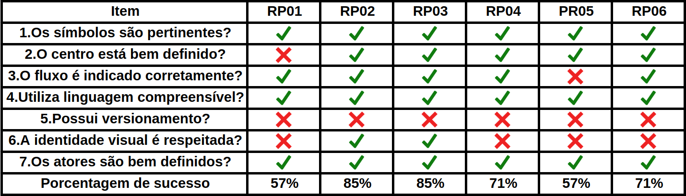

# RichPicture

## Versionamento

| Versão | Data | Modificação | Autor |
| :----: | :--: | :---------: | :---: |
|  0.1   | 30/10/2019 | Criação do documento | [Murilo Loiola Dantas](https://github.com/murilo-dan) |
| 1.0    | 30/10/2019 | Adição do checklist e resultados | [Murilo Loiola Dantas](https://github.com/murilo-dan) |

## Introdução

&emsp;&emsp;Este documento tem como objetivo relatar a detecção de defeitos nos artefatos referentes aos <a href="/rich_picture">RichPictures</a> produzidos pelo grupo durante a etapa de pré-rastreabilidade. Para este fim, a utilização de um checklist mostrou-se a maneira mais clara e eficaz para encontrar possíveis falhas. Nos checklists elaborados, buscou-se uma forma de padronizar a verificação dos artefatos requeridos, utilizando questões pertinentes para o conjunto. 

## Questões
| Questões | Descrição |
| :----- | ----- |
| 1.Os símbolos são pertinentes? | Os símbolos/imagens utilizados para representar os atores/funcionalidades facilitam o entendimento e a leitura do RichPicture?  |
| 2.O centro está bem definido? | Em um RichPicture, é importante que o ator/funcionalidade principal esteja bem claro e definido. Para isso, é importante posicionar o elemento principal no centro e destacá-lo utilizando fontes maiores e/ou mais fortes. |
| 3.O fluxo é indicado corretamente? | É importante destacar a direção do fluxo com a utilização de setas. A não utilização desse recurso faz com que o artefato torne-se confuso e ambíguo. |
| 4.Utiliza linguagem compreensível? | A linguagem utilizada para descrever os elementos deve ser de fácil entendimento, de forma a aumentar a abrangência do artefatos. |
| 5.Possui versionamento? | Os artefatos devem ser versionados, de forma a facilitar a rastreabilidade e o acompanhamento da evolução do desenvolvimento. |
| 6.A identidade visual é respeitada? | É importante que os artefatos tenham a mesma identidade visual, pois isso facilita a relação entre funcionalidades semelhantes e evita confusão. |
| 7.Os atores são bem definidos? | É importante deixar claro quais são os atores envolvidos e de que forma cada um impacta o fluxo de ações. Isso ajuda a perceber interações importantes no processo. |

## Checklist

## Resultados

&emsp;&emsp;Analisando o checklist, é possível perceber que a maior falha nos RichPictures é a falta de versionamento. Essa falha será corrigida utilizando o versionamento do repositório do grupo no GitHub. Além disso, é importante destacar que dois RichPictures apresentam somente 57% de sucesso, uma taxa notavelmente baixa. Com essa análise, esses dois RichPictures receberão mais foco durante o tratamento de erros. 

## Referências

<a href="https://fga-disciplinas.github.io/2019.1-Guia-Bolso/analise/analise_rich_picture/">Página de verificação dos RichPictures do grupo GuiaBolso - 2019.1</a> 
<a href="https://requisitos-habitica.netlify.com/">Página do grupo Habitica - 2019.1</a>
